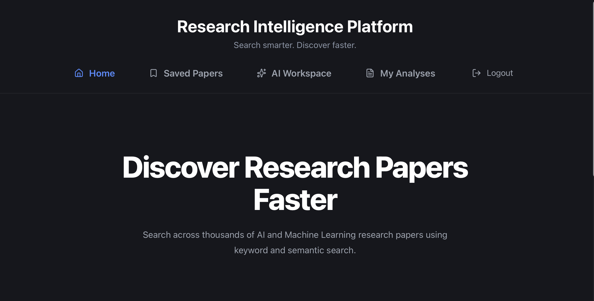
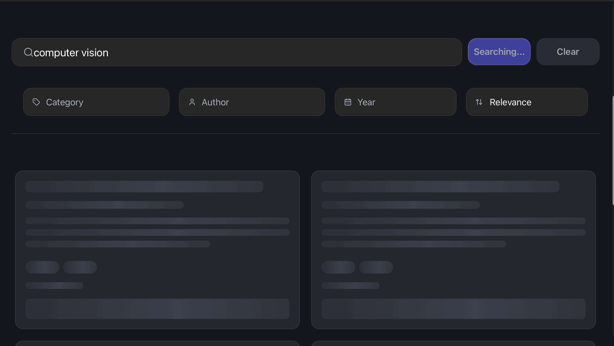
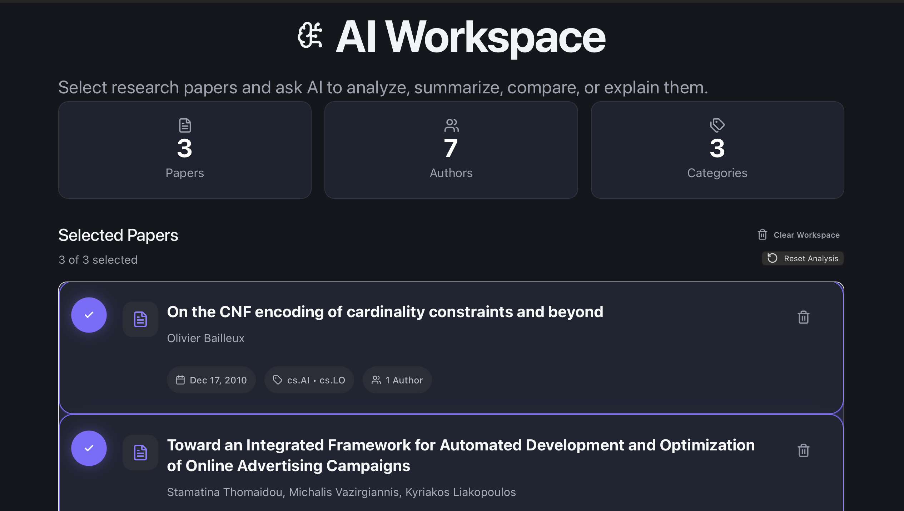
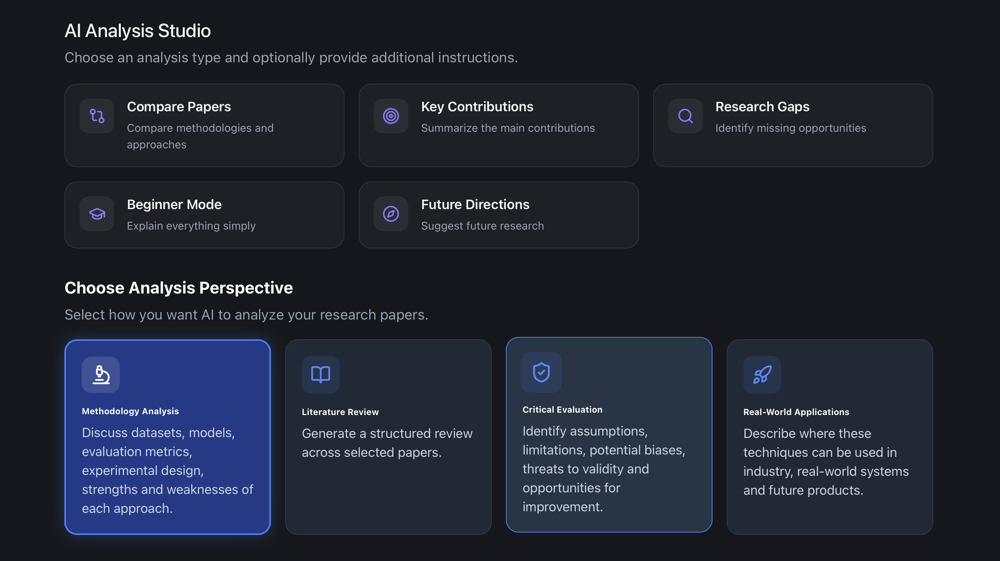
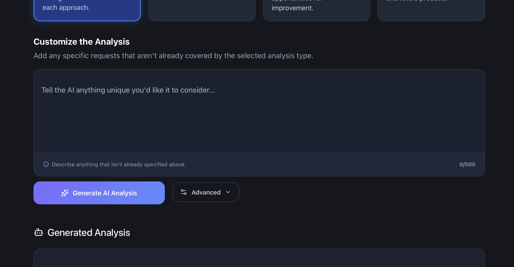

# Research Intelligence Platform

> An AI-powered research discovery and analysis platform for finding, understanding, organizing, and analyzing scientific literature.

The Research Intelligence Platform (RIP) is a full-stack application designed to simplify the research workflow by bringing paper discovery, semantic search, AI-assisted analysis, personal paper management, and persistent research workspaces into a single platform.

Instead of relying solely on keyword-based search, RIP combines lexical and semantic retrieval to identify papers that are relevant both to the exact terms used in a query and to the underlying meaning of the research question.

Users can discover research papers, inspect detailed metadata, save papers to a personal library, add papers to an AI Workspace, generate AI-powered analyses, and save those analyses for later reference.

---

## 🌐 Live Demo

**Frontend:** [Research Intelligence Platform](https://research-intelligence-platform-iota.vercel.app)

**Backend API:** [Research Intelligence Platform API](https://research-intelligence-platform.onrender.com)

The production application is deployed with the frontend hosted on Vercel and the FastAPI backend hosted on Render.

---

## 📸 Screenshots

### Landing Page

A clean research-focused interface designed around fast paper discovery.



### Research Discovery

Search for research papers using hybrid lexical and semantic retrieval, with filtering, sorting, and pagination.



### Paper Details

Inspect individual papers, including their metadata, abstract, authors, categories, publication information, and source link.


### AI Workspace

Build an AI-assisted research workflow by selecting papers and configuring the desired analysis.



Configure the analysis using different analysis types, depths, writing styles, output formats, and additional instructions.



Generate and review the resulting AI-powered research analysis directly within the workspace.



### My Analyses

Access and manage previously saved AI-generated research analyses.


---

## ✨ Features

### 🔎 Hybrid Research Search

Search the research-paper collection using a hybrid retrieval pipeline that combines:

- Lexical relevance
- Semantic similarity
- Hybrid relevance scoring
- Category filtering
- Author filtering
- Publication-year filtering
- Relevance/date sorting
- Pagination

This allows the platform to retrieve papers based on both **what the user searches for** and **what the query means**.

### 📄 Research Paper Discovery

Each paper provides:

- Title
- Authors
- Abstract
- Categories
- Publication date
- arXiv identifier
- Direct arXiv link
- Relevance scores

Users can open a dedicated paper-details page to inspect the complete available metadata.

### ❤️ Personal Saved Papers

Authenticated users can save papers to their personal research library.

Saved papers are associated with the authenticated user, ensuring that each user has their own collection.

### 🧠 AI Workspace

The AI Workspace allows users to select multiple papers and perform AI-assisted research analysis across them.

Supported analysis types include:

- Methodology analysis
- Literature review
- Critical evaluation
- Applications

Users can additionally configure:

- Analysis depth
- Writing style
- Output format
- Additional instructions

### 🤖 AI-Powered Analysis

The platform uses an LLM-backed analysis pipeline to generate structured research outputs from the selected papers.

Generated analyses can be saved and accessed later through **My Analyses**.

### 📚 My Analyses

Authenticated users can:

- View previously saved analyses
- Open individual analyses
- Review the papers used in an analysis
- Delete saved analyses

Analyses are associated with the authenticated user and are therefore isolated between users.

### 🔐 Authentication

RIP includes user authentication using:

- Email/password registration
- Secure password hashing
- JWT-based authentication
- Protected API endpoints
- Protected application routes
- User-specific saved papers
- User-specific saved analyses

Unauthenticated users can still discover and browse research papers, while user-specific functionality requires authentication.

### ⚙️ Automated Paper Ingestion

The backend includes a scheduled ingestion system that periodically checks for new research papers and updates the platform's paper collection automatically.

The ingestion process is managed by an application-level scheduler running alongside the backend service.

---

## 🏗️ How It Works

At a high level, RIP follows this workflow:

```text
                    ┌─────────────────────┐
                    │      User Query     │
                    └──────────┬──────────┘
                               │
                               ▼
                    ┌─────────────────────┐
                    │   Hybrid Search     │
                    │                     │
                    │ Lexical + Semantic  │
                    └──────────┬──────────┘
                               │
                               ▼
                    ┌─────────────────────┐
                    │ Ranked Paper Results│
                    └──────────┬──────────┘
                               │
                 ┌─────────────┼─────────────┐
                 ▼             ▼             ▼
          View Paper      Save Paper    Add to Workspace
                                             │
                                             ▼
                                  ┌─────────────────────┐
                                  │    AI Workspace     │
                                  └──────────┬──────────┘
                                             │
                                             ▼
                                  ┌─────────────────────┐
                                  │    LLM Analysis     │
                                  └──────────┬──────────┘
                                             │
                                             ▼
                                  ┌─────────────────────┐
                                  │    Save Analysis    │
                                  └──────────┬──────────┘
                                             │
                                             ▼
                                  ┌─────────────────────┐
                                  │    My Analyses      │
                                  └─────────────────────┘
```

---

## 🛠️ Technology Stack

### Frontend

- **React** — User interface and component-based application architecture
- **TypeScript** — Type-safe frontend development
- **Vite** — Frontend development and production build tooling
- **React Router** — Client-side routing and protected application routes
- **Axios** — Communication between the frontend and backend API
- **Lucide React** — Interface icons
- **CSS** — Custom application styling

### Backend

- **Python**
- **FastAPI** — REST API and backend application framework
- **Uvicorn** — ASGI application server
- **Pydantic** — Request/response validation and data modelling
- **APScheduler** — Automated paper-ingestion scheduling

### AI & Search

- **Sentence Transformers** — Semantic embedding generation
- **Vector similarity search** — Semantic retrieval of research papers
- **Lexical search** — Keyword-based retrieval
- **Hybrid ranking** — Combination of lexical and semantic relevance
- **LLM integration** — AI-powered paper summarization and workspace analysis

### Database

- **PostgreSQL** — Persistent application database
- **pgvector** — Vector storage and similarity search
- **psycopg2** — PostgreSQL connectivity

### Authentication

- **pwdlib** — Secure password hashing
- **JWT** — Stateless authentication tokens
- **python-jose** — JWT creation and verification

### Deployment

- **Vercel** — Frontend deployment
- **Render** — Backend deployment
- **Neon PostgreSQL** — Hosted PostgreSQL database

---

## 🏗️ System Architecture

RIP follows a client-server architecture with a React/TypeScript frontend communicating with a FastAPI backend through REST APIs.

```text
┌──────────────────────────────────────────────────────────────┐
│                           USER                               │
└────────────────────────────┬─────────────────────────────────┘
                             │
                             ▼
┌──────────────────────────────────────────────────────────────┐
│                    React Frontend                            │
│                         Vercel                               │
│                                                              │
│  Search │ Paper Details │ Saved Papers │ AI Workspace       │
│  Authentication │ My Analyses                              │
└────────────────────────────┬─────────────────────────────────┘
                             │
                       REST API / JWT
                             │
                             ▼
┌──────────────────────────────────────────────────────────────┐
│                    FastAPI Backend                           │
│                         Render                               │
│                                                              │
│  Authentication │ Search │ Papers │ Workspace │ Analyses    │
└───────────────┬───────────────────────┬──────────────────────┘
                │                       │
                ▼                       ▼
┌──────────────────────────┐   ┌───────────────────────────────┐
│      PostgreSQL          │   │        AI / Search Layer      │
│        Neon              │   │                               │
│                          │   │  Embeddings │ Hybrid Search   │
│ Users                    │   │  LLM        │ Ranking         │
│ Papers                   │   │                               │
│ Analyses                 │   └───────────────────────────────┘
│ Analysis-Paper Relations │
└──────────────────────────┘
                ▲
                │
                │ Scheduled ingestion
                │
┌───────────────┴──────────────────────────────────────────────┐
│                  Paper Ingestion Pipeline                    │
│                                                              │
│  Research Source → Fetch → Process → Embed → Store           │
└──────────────────────────────────────────────────────────────┘
```

---

## 📁 Project Structure

```text
research-intelligence-platform/
│
├── api/
│   ├── routes/
│   │   ├── auth.py
│   │   ├── analyses.py
│   │   └── ...
│   │
│   ├── services/
│   │   ├── auth_service.py
│   │   ├── analysis_service.py
│   │   ├── workspace_service.py
│   │   ├── ai_service.py
│   │   └── ...
│   │
│   ├── database.py
│   ├── models.py
│   └── main.py
│
├── ingestion/
│   ├── ...
│   └── scheduler.py
│
├── frontend/
│   └── src/
│       ├── auth/
│       ├── components/
│       ├── context/
│       ├── pages/
│       ├── services/
│       ├── types/
│       └── App.tsx
│
├── schema.sql
├── requirements.txt
└── README.md
```

---

## 🔎 Hybrid Search

RIP uses a hybrid retrieval approach to improve research-paper discovery beyond traditional keyword matching.

A search query is processed through two complementary retrieval signals:

1. **Lexical relevance** — identifies papers containing terms that closely match the user's query.
2. **Semantic similarity** — compares the meaning of the query with the semantic representation of indexed papers.

These signals are combined into a hybrid relevance score, allowing the system to retrieve papers that are relevant both lexically and semantically.

### Search Pipeline

```text
User Query
    │
    ▼
Query Processing
    │
    ├──────────────────────┐
    ▼                      ▼
Lexical Search       Query Embedding
    │                      │
    ▼                      ▼
Lexical Scores       Semantic Scores
    │                      │
    └──────────┬───────────┘
               ▼
        Hybrid Ranking
               │
               ▼
       Apply Filters
               │
               ▼
        Sort Results
               │
               ▼
          Pagination
               │
               ▼
        Search Results
```

The hybrid search endpoint returns individual relevance signals along with the final hybrid score for each result. This allows the frontend to present ranked results while retaining the underlying retrieval metrics for evaluation and future ranking improvements.

### Search Filters

Users can refine results using:

- Research category
- Author
- Publication year
- Relevance
- Publication date

The search API also exposes pagination metadata, including total results and total pages.

---

## 📥 Automated Paper Ingestion

The platform maintains its research-paper collection through an automated ingestion pipeline.

The ingestion system periodically checks the configured research source for new papers, processes the retrieved metadata, generates vector representations, and stores the resulting records in PostgreSQL.

```text
Research Source
      │
      ▼
Fetch Papers
      │
      ▼
Extract Metadata
      │
      ▼
Check Existing Papers
      │
      ├── Already Indexed ──► Skip
      │
      └── New Paper
             │
             ▼
       Generate Embedding
             │
             ▼
       Store in PostgreSQL
             │
             ▼
       Available for Search
```

### Scheduled Ingestion

The backend uses APScheduler to periodically execute the ingestion process.

The scheduler runs as part of the FastAPI application's lifecycle:

```text
Application Startup
       │
       ▼
Start Scheduler
       │
       ▼
Periodic Ingestion Job
       │
       ▼
Check for New Papers
       │
       ▼
Update Database
       │
       ▼
Application Shutdown
       │
       ▼
Stop Scheduler
```

This allows the paper collection to be updated automatically without requiring manual ingestion runs.

---

## 🔐 Authentication Architecture

RIP uses JWT-based authentication to secure user-specific functionality while keeping research discovery publicly accessible.

### Authentication Flow

```text
User
 │
 ▼
Register / Login
 │
 ▼
FastAPI Authentication API
 │
 ├── Password Hashing
 │
 └── Credential Verification
 │
 ▼
JWT Access Token
 │
 ▼
Frontend Authentication State
 │
 ▼
Authenticated API Requests
 │
 │  Authorization: Bearer <token>
 ▼
JWT Validation
 │
 ▼
Authenticated User
```

### Protected Functionality

Authentication is required for:

- Saved Papers
- AI Workspace
- My Analyses
- Saving and managing analyses

Public functionality remains available without authentication, including:

- Research paper search
- Search filtering and sorting
- Paper details

### User-Specific Data

User-specific resources are associated with the authenticated user's database ID.

This ensures that:

- Saved papers belong to the corresponding user.
- Saved analyses belong to the corresponding user.
- Users cannot access another user's saved analyses through protected API endpoints.

Passwords are never stored in plaintext. Passwords are securely hashed before being persisted in PostgreSQL.

JWT access tokens contain the authenticated user's ID and an expiration time. Protected backend routes validate the token before performing user-specific operations.

---

## 🧠 AI Workspace

The AI Workspace provides a dedicated environment for performing AI-assisted analysis across selected research papers.

Users can add papers discovered through search to the workspace and configure an analysis before generating the final output.

### Workspace Workflow

```text
Search Results
      │
      ▼
Select Papers
      │
      ▼
AI Workspace
      │
      ├── Analysis Type
      ├── Analysis Depth
      ├── Writing Style
      ├── Output Format
      └── Additional Instructions
      │
      ▼
Build Analysis Prompt
      │
      ▼
LLM
      │
      ▼
Generated Analysis
      │
      ├── Copy
      ├── Save
      └── Reset
      │
      ▼
My Analyses
```

### Supported Analysis Types

The workspace currently supports:

- **Methodology** — Examine the methodological approaches used in the selected papers.
- **Literature Review** — Synthesize the selected papers into a broader literature perspective.
- **Critical Evaluation** — Evaluate strengths, limitations, and research considerations.
- **Applications** — Explore practical applications and implications of the research.

### Analysis Configuration

Users can customize the generated output through:

- Analysis depth
- Writing style
- Output format
- Additional instructions

The selected papers and configuration options are used to construct the analysis prompt sent to the LLM.

### Paper Summarization

RIP also provides AI-assisted summarization for individual papers, allowing users to obtain a concise summary without creating a multi-paper workspace analysis.

---

## 🗄️ Database Architecture

RIP uses PostgreSQL as its primary persistent data store, with pgvector supporting vector-based semantic retrieval.

### Core Tables

```text
┌──────────────────┐
│      users       │
├──────────────────┤
│ id               │
│ email            │
│ password_hash    │
│ created_at       │
└────────┬─────────┘
         │
         │ 1:N
         ▼
┌──────────────────┐
│    analyses      │
├──────────────────┤
│ id               │
│ user_id          │
│ title            │
│ analysis_type    │
│ analysis_depth   │
│ writing_style    │
│ output_format    │
│ additional_...   │
│ generated_...    │
│ created_at       │
└────────┬─────────┘
         │
         │ 1:N
         ▼
┌──────────────────────┐
│   analysis_papers    │
├──────────────────────┤
│ analysis_id          │
│ paper_arxiv_id       │
└──────────┬───────────┘
           │
           │ N:1
           ▼
┌──────────────────┐
│      papers      │
├──────────────────┤
│ id               │
│ arxiv_id         │
│ title            │
│ abstract         │
│ published_date   │
│ authors          │
│ categories       │
│ arxiv_url        │
│ updated_date     │
│ embedding_vector │
└──────────────────┘
```

### Data Relationships

- A **user** can have multiple saved analyses.
- An **analysis** can reference multiple research papers.
- A **paper** can be referenced by multiple analyses.
- Paper embeddings are stored alongside paper metadata for semantic retrieval.

---

## 🔌 API Overview

The backend exposes RESTful endpoints through FastAPI.

### Authentication

| Method | Endpoint | Description |
|--------|----------|-------------|
| `POST` | `/auth/register` | Register a new user |
| `POST` | `/auth/login` | Authenticate a user and issue a JWT |

### Research

| Method | Endpoint | Description |
|--------|----------|-------------|
| `GET` | `/hybrid-search` | Search and rank research papers |
| `GET` | `/papers/{arxiv_id}` | Retrieve paper details |

### AI Workspace

| Method | Endpoint | Description |
|--------|----------|-------------|
| `POST` | `/workspace/summarize` | Generate an AI summary of a paper |
| `POST` | `/workspace/analyze` | Generate an AI analysis from selected papers |

### Saved Analyses

| Method | Endpoint | Description |
|--------|----------|-------------|
| `POST` | `/analyses` | Save a generated analysis |
| `GET` | `/analyses` | Retrieve the authenticated user's analyses |
| `GET` | `/analyses/{analysis_id}` | Retrieve a specific analysis |
| `DELETE` | `/analyses/{analysis_id}` | Delete an analysis |

Protected endpoints require a valid JWT bearer token.

---

## 🚀 Local Development

### Prerequisites

Before running RIP locally, ensure the following are installed:

- Python
- Node.js and npm
- PostgreSQL-compatible database
- Git

### Clone the Repository

```bash
git clone <repository-url>
cd research-intelligence-platform
```

### Backend Setup

Create and activate a virtual environment:

```bash
python -m venv venv
source venv/bin/activate
```

On Windows:

```bash
venv\Scripts\activate
```

Install backend dependencies:

```bash
pip install -r requirements.txt
```

Create a `.env` file containing the required backend environment variables.

Start the FastAPI application:

```bash
uvicorn api.main:app --reload
```

### Frontend Setup

Navigate to the frontend:

```bash
cd frontend
```

Install dependencies:

```bash
npm install
```

Create the required frontend environment configuration and start the development server:

```bash
npm run dev
```

The frontend and backend can then be accessed through their respective local development URLs.

---

## 🔑 Environment Variables

RIP uses environment variables for configuration and sensitive credentials.

### Backend

Typical backend configuration includes:

```text
DATABASE_URL=
JWT_SECRET_KEY=
```

Additional API credentials may be required depending on the configured AI and research-data services.

### Frontend

The frontend requires the backend API base URL:

```text
VITE_API_BASE_URL=
```

Sensitive credentials should never be committed to the repository.

For production deployments, environment variables are configured through the respective hosting platforms.

---

## 🌐 Deployment

RIP is deployed using separate frontend and backend services.

### Frontend

The React frontend is deployed through Vercel.

### Backend

The FastAPI backend is deployed through Render.

### Database

The production PostgreSQL database is hosted through Neon and provides persistent storage for users, research papers, analyses, and vector embeddings.

### Production Flow

```text
                         Internet
                            │
                            ▼
                  ┌──────────────────┐
                  │ Vercel Frontend  │
                  └────────┬─────────┘
                           │
                        REST API
                           │
                           ▼
                  ┌──────────────────┐
                  │ Render Backend   │
                  │     FastAPI      │
                  └───────┬──────────┘
                          │
                          ▼
                  ┌──────────────────┐
                  │ Neon PostgreSQL  │
                  │    + pgvector    │
                  └──────────────────┘
```

The production frontend communicates with the deployed FastAPI backend through the configured API base URL.


## 🧪 Testing & Verification

The application has been manually verified across its primary user workflows.

### Authentication

- User registration
- Duplicate email handling
- Login
- Logout
- Protected route redirects
- JWT-authenticated API requests

### Research Discovery

- Paper search
- Hybrid ranking
- Search filters
- Sorting
- Pagination
- Paper details

### Personal Research Management

- Save paper
- Remove saved paper
- User-specific saved papers
- Workspace paper selection

### AI Workspace

- Paper selection
- Analysis configuration
- AI analysis generation
- Paper summarization
- Analysis reset
- Workspace clearing
- Analysis persistence

### Saved Analyses

- Save generated analysis
- Retrieve saved analyses
- Open individual analyses
- Delete analyses
- User-specific analysis access

---

## 🔮 Future Improvements

Potential future development areas include:

- Retrieval-Augmented Generation (RAG)
- More advanced research agents
- Improved semantic and hybrid ranking
- Expanded research-data sources
- More sophisticated paper recommendation
- Research trend analysis
- Citation and paper relationship exploration
- Advanced analysis workflows
- Improved observability and ingestion monitoring
- Expanded automated testing

---

## 📄 License

This project is currently intended as a personal/portfolio project.

License information will be added as the project distribution model is finalized.